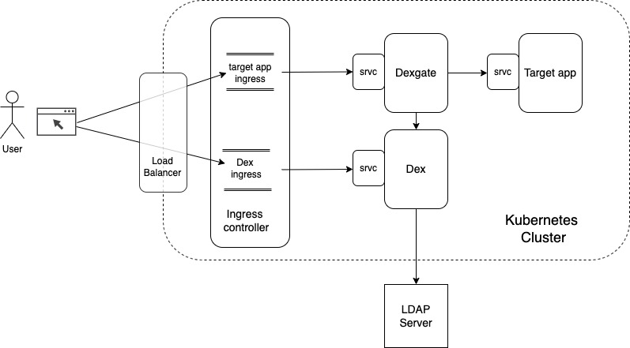
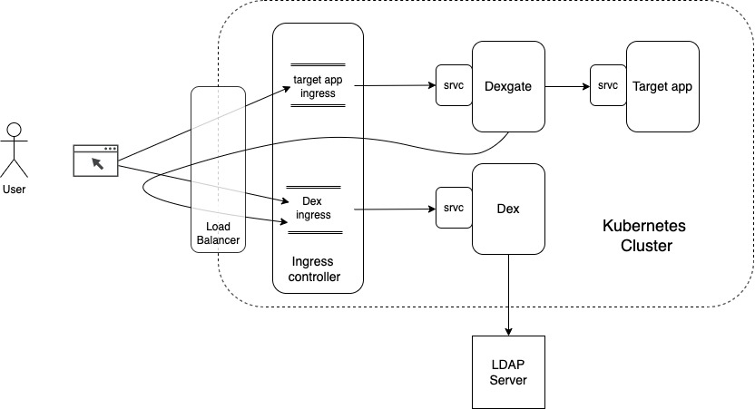

# Dexgate, an OIDC authentication proxy. 

## Overview

`Dexgate` is a reverse proxy intended to authenticate access to a web front end.

It is intended to be used in front of a web server which does not provide access control. It is a simple gatekeeper, with a logic of 'access all' or 'no access at all'.

Designed to be used in a kubernetes context, it is intended to be inserted between the ingress controller and the web application service.

It works in cooperation with an OIDC authentication server. Currently, the only one tested is [DEX](https://github.com/dexidp/dex), one of the most used in a Kubernetes context.

## How it works

A good understanding of the interaction between the componants is required to setup a working configuration.

As depicted below, `dexgate` is inserted beetween the ingress controller of the web application and the web application itself (To its Kubernetes Service in fact).



A typical successful user interaction is the following:

1. The user intend to access the targeted Web Application. For this it send an http request targeted to the corresponding ingress controller endpoint. This ingress controller 
will forward the request to `dexgate`.
2. `dexgate` handle the request. As there is no valid session cookie in this request, a new HTTP session is initiated and the requested URL is saved in. Then `dexgate` reply 
with a redirect response targeting a login URL provided by the dex server. (Accessed throught its own ingress controller)
3. The `dex` server handle the request by sending back a Login form.
4. The user fill the form and post information to the `dex` server.
5. The `dex` server check the provided credentials against the `ldap` server. Which provide also some other information about the user (Email, groups, ...). 
The `dex` server then reply to the user by sending a redirect to the callback URL of dexgate, with a specific code as one of the parameter.
6. On receipt of this redirection `dexgate` read the code and send a request to the `dex` server to validate this authentication code.
7. The `dex` server reply with both an oauth2 token and an OIDC JWT token corresponding to the code
8. `dexgate` decode the OIDC token witch carry information about the user, such as name, email, groups, ... (Such info are name `claims` in OIDC jargon). 
Based on these informations, user access is validated.
9. `dexgate` store the oauth token in the session, to mark it as valid and redirect the user to the initial requested page, stored in step 2.
10. The user's browser resend the same request as in step 1. But, this time, there is an active and valid HTTP session, `dexgate` forward the request to the targeted web application.
11. The user can now freely access the targeted web application until the HTTP session expire. 

A more formal description of this could be find [here](docs/dexgate-Sequence.jpg)

Alternate interaction:
- If the user is not authenticated in step 5, `dex` will resend the login page.
- If the user is authenticated but its profile does not allow `dexgate` to grant access, it will be redirected to an 'allowed' page. 

### Initialisation:

An OIDC server provide a set of entry points for different action (User login interaction, code validation, token renewal, etc....). 

Fortunately, for an administrator, there is only one to define: the so called 'issuer URL'. 

When `dexgate` start, it will retrieve  the OIDC configuration from a 'well known' path, based on this issuer URL. 
For example, if the issuer URL is  `https://dex.ingress.my.cluster.com/dex`, it will send a request to `https://dex.ingress.my.cluster.com/dex/.well-known/openid-configuration`

## Configuration

`Dexgate` configuration is performed using two separate files: One for the general configuration and one describing user permission.

The main reason for such separation is that the configuration has no reason to change once setup is completed, while user permission change are usual.

The default configuration file is `config.yml`. Its name and path can be overriden using the `--config` parameter.


| Name                        | req. | Default     | Description                                                                                                                                             |
|-----------------------------|------|-------------|---------------------------------------------------------------------------------------------------------------------------------------------------------|
| N/A                         | No   | config.yml  | Path of the main config file hosting the below parameters                                                                                               |
| logLevel                    | No   | INFO        | Log level (PANIC,FATAL,ERROR,WARN,INFO,DEBUG,TRACE)                                                                                                     |
| logMode                     | No   | json        | In which form log are generated:<br>`json`: Appropriate for further indexing.<br>`dev`: More human readable                                             |
| bindAddr                    | No   | :9001       | The address `dexgate` will be listening on.                                                                                                             |
| targetURL                   | Yes  |             | The URL of the targeted web application. Typically, refer to a K8s Service                                                                              |
| oidc.clientID               | Yes  |             | OAuth2 client ID of this application.                                                                                                                   |
| oidc.clientSecret           | Yes  |             | The secret associated to this clientID                                                                                                                  |
| oidc.issuerURL              | Yes  |             | The OIDC server main URL entry. See above                                                                                                               |
| oidc.redirectURL            | Yes  |             | Where the OIDC server will redirect the user once authenticated. For security reasons, this URL must be also provided in the OIDC server configuration. |
| oidc.scopes                 | No   | ["profile"] | A list of string defining the type of user information we want to grab from the user. Typically can be ["profile", "email", "groups"]                   |
| oidc.rootCAFile             | No   |             | The root Certificate Authority used to validate the HTTPS echange with the Issuer URL (Not needed if the Issuer URL is HTTP)                            |
| oidc.loginURLOverride       | No   |             | Allow override of scheme and host:port of the user login URL. See below                                                                                 |
| oidc.debug                  | No   | False       | Add a bunch of message for OIDC exchange. Quite verbose. To use only for debuging                                                                       |
| passthroughs                | No   | []          | A list or URL Path which will go through `dexgate` without any authorisation. A typical usage is to set to [ "/favicon.ico" ]                           |
| tokenDisplay                | No   | False       | Display an intermediate page after login providing token values and associated information. For debugging only.                                         |
| sessionConfig.idleTimeout   |      |             |                                                                                                                                                         |
| sessionConfig.lifeTime      |      |             |                                                                                                                                                         |
| userConfigFile              |      |             |                                                                                                                                                         |
| userConfigMap.namespace     |      |             |                                                                                                                                                         |
| userConfigMap.configMapName |      |             |                                                                                                                                                         |
| userConfigMap.configMapKey  |      |             |                                                                                                                                                         |


Also, some of the configuration parameters can be overriden on the command line:

```
$ ./dexgate --help
Usage of ../../dexgate/bin/dexgate:
--config string                    Configuration file (default "config.yml")
--logLevel string                  Log level (PANIC|FATAL|ERROR|WARN|INFO|DEBUG|TRACE) (default "INFO")
--logMode string                   Log mode: 'dev' or 'json' (default "json")
--bindAddr string                  The address to listen on. (default ":9001")
--targetUrl string                 All requests will be forwarded to this URL
--oidcDebug                        Print all request and responses from the OpenID Connect issuer.
--tokenDisplay                     Display an intermediate token page after login (Debugging only).
--idleTimeout string               The maximum length of time a session can be inactive before being expired (default "15m")
--sessionLifetime string           The absolute maximum length of time that a session is valid. (default "6h")
--oidcRootCAFile string            Root CA for validation of issuer URL.
--usersConfigFile string           Users/Groups permission file.
--usersConfigMapNamespace string   Users/Groups permission configMap namespace.
--usersConfigMapName string        Users/Groups permission configMap name.
--usersConfigMapKey string         Users/Groups permission key in configMap. (default "users.yml")
--loginURLOverride string          Allow overriding of scheme and host part of the login URL provided by the OIDC server.
```


## Users authorisation Hot Reload


## The Issuer URL.

A stated above, one of the main configuration parameter is the 'Issuer URL' 

- This URL must be defined both in `dex` and `dexgate` configuration with the same value.
- All other endpoints are based on this issuer URL (Same scheme and host).
- As the user login URL is based on, this URL must be reachable from outside the kubernetes cluster.

This last constraint means the issuer URL will typically be handled by the entry load balancer/ingress controler. 
And, as there is only one configuration value, this means the connexion betweeen `dexgate` and `dex` will also go through this path. 
So, the effective interaction is more like the following:



### login URL overriding

There may be some network configuration where such path will not works. It may be impossible for a pod to reach another one by using the external entry point, as depicted above.

In such case, a specific parameter has been added to override the URL sent to the user for the login. To use it, the Issuer URL must be defined using the kubernetes internal `dex` address,
like `http://dex.<dexnamespace>.svc:5556/dex`. Doing so, the commnunication between `dexgate` and `dex` will be direct, as in the first picture. 

But, the login url which is also based on this adress, will be unreachable from outside of the Kubernetes context. To fix this, add the following in the configuration:

```
oidc:
  loginURLOverride: https://dex.ingress.my.cluster.com   # Adjust the URL to your context
```

Note than only the scheme and host part (Including port) can be overriden.

## Deployment


## Used library

Bsed on Dex example app

Http Session management
OIDC client
Reverse proxy
