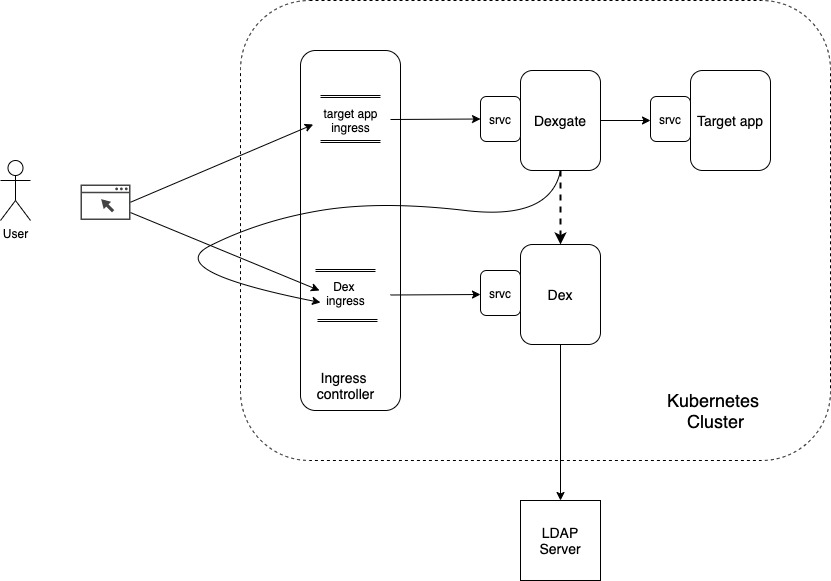
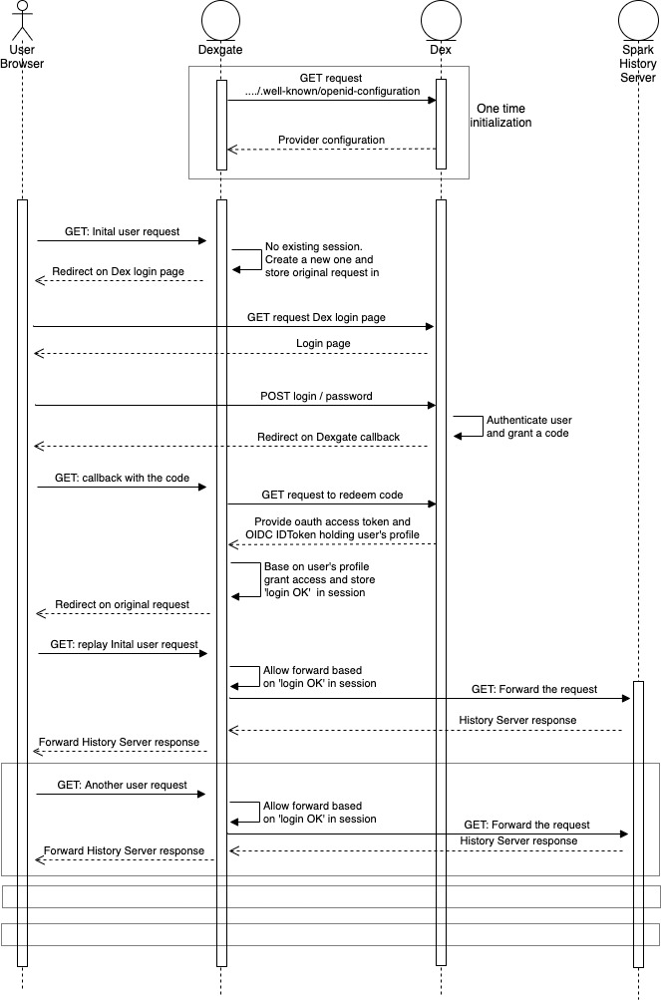

# dexgate, an OIDC authentication proxy. 

## Overview

Dexgate is a reverse proxy intended to authenticate access to a web front end.

It is intended to be used in front of a web server which does not provide access control. It is a simple gatekeeper, with a logic of 'access all' or 'no access at all'.

Designed to be used in a kubernetes context, it is intended to be inserted between the ingress controller and the web application service.

It works in cooperation with an OIDC authentication server. Currently, the only one tested is [DEX](https://github.com/dexidp/dex), one of the most used in a Kubernetes context.

## Architecture

## Deployment

## Users authorisation Hot Reload

## Configuration reference